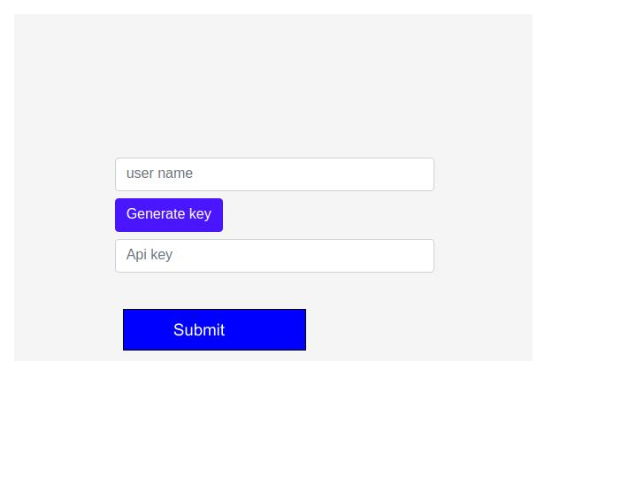

Backend-end Test Project
======================

## Project brief
Ilightup analytics is set to create its own Api to distribute sensitive data to 
its client.They currently want a GET request only.
Due to the nature of sensitivity the data access restrictions have to be put into place.
They want you to automate a system that uniquely generates
  an Api key and assigns it to each first time user.
 

## Concepts tested
1. Rest Api
2. Api keys
3. User management
4. Database
### Sample idea

## Requirements
1. A simple interface like sample idea above meant for new users.Each user should have a unique key.
2. A user database that stores user info inclusive of their api key
3. Create a simple database and put sample data that will be served out eg(weather)
4. Create a simple database  REST api data end point(json format) example
http://ziarafrica.herokuapp.com/orders
5. Include the Api key as one of the parameters of each get requests. example http://ziarafrica.herokuapp.com/orders?key=Your_key_here
4. Ensure proper error handling.example http://bustime.mta.info/api/where/stops-for-location.json?lat=40.748433&lon=-73.985656&latSpan=0.005&lonSpan=0.005&key=YOUR_KEY_HERE

 

## Supported browsers
Ensure that the elements work and display correctly in the following browsers:

- Firefox (latest version)
- Google Chrome (latest version)
- Microsoft Edge
- Internet Explorer 11

## Coding Standards
When working on the project use consistent coding style.Stylelint, ESLint (see [Code Quality](https://www.getchisel.co/docs/development/code-quality/)), [ITCSS](https://www.getchisel.co/docs/development/itcss/), etc.

## Project Deadline
Take your time but try to deliver it within 4hrs time.

## Quality Assurance

What you need to do to get high QA score? Simply answer **Yes** to all these questions:

### General

- Are all requirements set above met?
- Can the project be built using `npm run`?
- Is the page working without any JS errors?

### Precision

- Is reasonable precision achieved?

### Browser check

- Does page display and work correctly in supported browsers?

### Valid HTML

- Is the page valid?

### Semantic Markup

- Are the correct tags being used?

### Coding Standards

- Is the page using a consistent HTML coding style?
- Is the page using a consistent CSS coding style?
- Is the page using a consistent JS coding style?

### Optimization

- Are image files sufficiently compressed?
- Is CSS and JS concatenated and minified?

### Accessibility

- Are proper ALT attributes for images provided?
- Are ARIA attributes properly used?
- Is proper heading structure in place?
