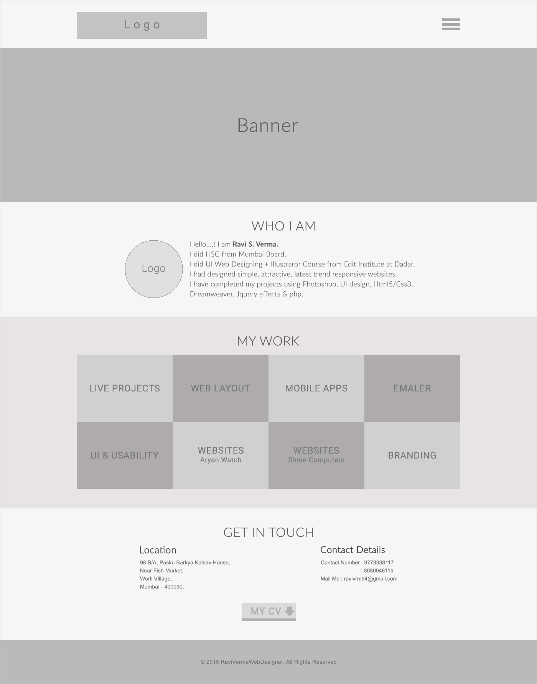

Portfolio
======================

## Project brief
You are to build a portfolio website based on past experiences.
Make it as appealing as possible.This project tests the capabilty 
of integrating various effects to ensure maximum appeal

## Concepts tested
1. Javascript effects
3. Svg animations

### Sample idea

## Requirements
1. Improved UI/UX
2. Follow the wireframe above to fulfill the expected layout.
3. Anime js
4. Should be responsive
5. All projects should link to a github or live demo of said project

## Coding Standards
When working on the project use consistent coding style.Stylelint, ESLint (see [Code Quality](https://www.getchisel.co/docs/development/code-quality/)), [ITCSS](https://www.getchisel.co/docs/development/itcss/), etc.

## Project Deadline
Take your time but try to deliver it within 6hrs time.

## Quality Assurance

What you need to do to get high QA score? Simply answer **Yes** to all these questions:

### General

- Are all requirements set above met?
- Can the project be built using `npm run`?
- Is the page working without any JS errors?

### Precision

- Is reasonable precision achieved?

### Browser check

- Does page display and work correctly in supported browsers?

### Valid HTML

- Is the page valid?

### Semantic Markup

- Are the correct tags being used?

### Coding Standards

- Is the page using a consistent HTML coding style?
- Is the page using a consistent CSS coding style?
- Is the page using a consistent JS coding style?

### Optimization

- Are image files sufficiently compressed?
- Is CSS and JS concatenated and minified?

### Accessibility

- Are proper ALT attributes for images provided?
- Are ARIA attributes properly used?
- Is proper heading structure in place?

