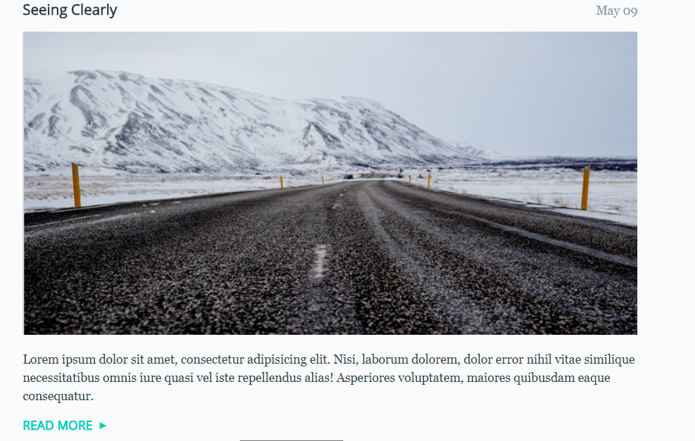
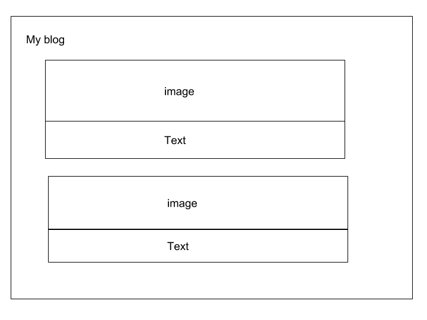
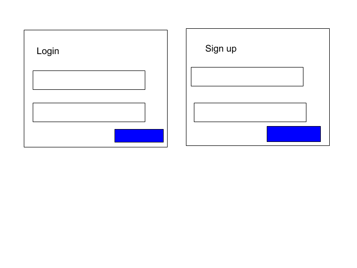

B-log
======================

## Project brief
A simple blog that will enable the user to express themselves via word and imagery

## Concepts tested
1. Client rendering
2. Database
3. Api endpoints
4. Crud operations

### Sample idea

## Requirements
1. Improved Ui 
2. Use the wireframes as guiding principle
3. User registration for the app
4. create database model(user,diary)
5. Backend server to handle data storage
6. Client side to render all data
7. Each user should only see posts created by them
8. The posts should have a creation date when displayed

## Coding Standards
When working on the project use consistent coding style.Stylelint, ESLint (see [Code Quality](https://www.getchisel.co/docs/development/code-quality/)), [ITCSS](https://www.getchisel.co/docs/development/itcss/), etc.

## Project Deadline
Take your time but try to deliver it within 6hrs time.

## Quality Assurance

What you need to do to get high QA score? Simply answer **Yes** to all these questions:

### General

- Are all requirements set above met?
- Can the project be built using `npm run`?
- Is the page working without any JS errors?

### Precision

- Is reasonable precision achieved?

### Browser check

- Does page display and work correctly in supported browsers?

### Valid HTML

- Is the page valid?

### Semantic Markup

- Are the correct tags being used?

### Coding Standards

- Is the page using a consistent HTML coding style?
- Is the page using a consistent CSS coding style?
- Is the page using a consistent JS coding style?

### Optimization

- Are image files sufficiently compressed?
- Is CSS and JS concatenated and minified?

### Accessibility

- Are proper ALT attributes for images provided?
- Are ARIA attributes properly used?
- Is proper heading structure in place?
