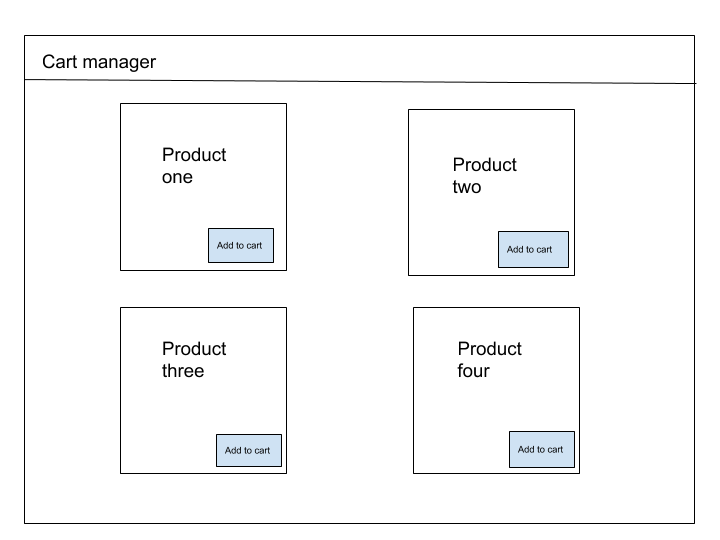
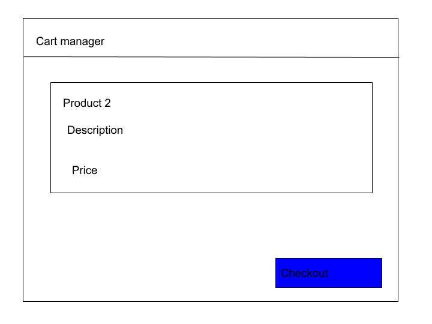
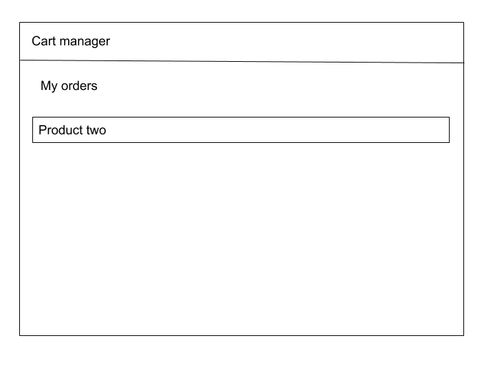

Cart manager
======================

## Project brief
A client approaches you to create shopping website and 
would like a session cart to track each user cart 
till they check out.All data should be stored after checkout.

## Concepts tested
1. Session carts 
2. Database
3. Api creation

### Sample idea

## Requirements
1. Improved UI/UX
2. Use the wireframe above
3. Product catalog
4. Render catalog from database under model products
5. Create database models(orders it should contain item purchased)
5. Checkout page showing product information.Save data to orders
6. Render user orders after checkout

## Coding Standards
When working on the project use consistent coding style.Stylelint, ESLint (see [Code Quality](https://www.getchisel.co/docs/development/code-quality/)), [ITCSS](https://www.getchisel.co/docs/development/itcss/), etc.

## Project Deadline
Take your time but try to deliver it within 6hrs time.

## Quality Assurance

What you need to do to get high QA score? Simply answer **Yes** to all these questions:

### General

- Are all requirements set above met?
- Can the project be built using `npm run`?
- Is the page working without any JS errors?

### Precision

- Is reasonable precision achieved?

### Browser check

- Does page display and work correctly in supported browsers?

### Valid HTML

- Is the page valid?

### Semantic Markup

- Are the correct tags being used?

### Coding Standards

- Is the page using a consistent HTML coding style?
- Is the page using a consistent CSS coding style?
- Is the page using a consistent JS coding style?

### Optimization

- Are image files sufficiently compressed?
- Is CSS and JS concatenated and minified?

### Accessibility

- Are proper ALT attributes for images provided?
- Are ARIA attributes properly used?
- Is proper heading structure in place?
